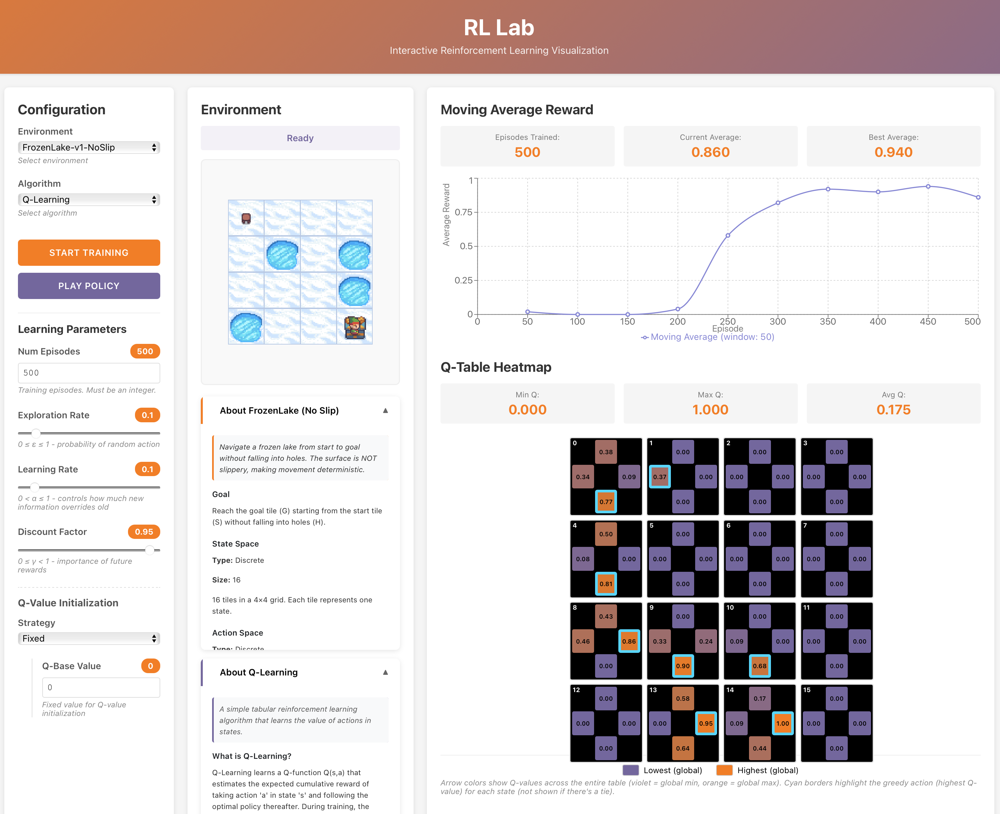

# RL I - Introduction

# RL Lab
An educational interface for building intuition about reinforcement learning fundamentals. The backend is build on the environments of the [gymnasium library](https://gymnasium.farama.org). 

**Current Implementation**: 
- environments
   - [Gymnasium FrozenLake-v1](https://gymnasium.farama.org/environments/toy_text/frozen_lake/) (4x4) with `is_slippery=True`
   - [Gymnasium FrozenLake-v1](https://gymnasium.farama.org/environments/toy_text/frozen_lake/) (4x4) with `is_slippery=False`
- algorithms
   - Q-learning (custom build)



## Quick Start (Experienced Users)

Already have git and Docker installed? Get started in 3 commands:

**Prerequisites**: Docker Desktop running or Docker Engine

1. Clone the repository
```bash
git clone https://github.com/aihpi/workshop-rl1-introduction.git
```

2. Navigate inside
```bash
cd workshop-rl1-introduction
```

3. Is Docker running? Then you can start the app (detached mode)
```bash
docker compose up -d
```

4. Open browser to http://localhost:3030


**First-time setup takes ~1-2 minutes** (downloads pre-built images).

**Note**: Running in detached mode (`-d`) keeps your terminal free. To view logs if needed for debugging, open a separate terminal and run `docker compose logs -f`

---

## Installation (Beginners)

**New to programming or Docker?** Follow the installation guides:

### Choose Your Operating System:

<table>
<tr>
<td align="center" width="33%">
<h3>📱 Windows</h3>
<p><strong><a href="docs/INSTALLATION_WINDOWS.md">Windows Installation Guide</a></strong></p>
<p>For Windows 10/11</p>
<p><em>~10-15 minutes</em></p>
</td>
<td align="center" width="33%">
<h3>🍎 macOS</h3>
<p><strong><a href="docs/INSTALLATION_MACOS.md">macOS Installation Guide</a></strong></p>
<p>For macOS 10.15+</p>
<p><em>~10-15 minutes</em></p>
</td>
<td align="center" width="33%">
<h3>🐧 Linux</h3>
<p><strong><a href="docs/INSTALLATION_LINUX.md">Linux Installation Guide</a></strong></p>
<p>For Ubuntu/Debian</p>
<p><em>~15-20 minutes</em></p>
</td>
</tr>
</table>

---

### Useful Docker Commands

Once installed, here are some helpful commands:

```bash
docker compose up -d           # Start the application (detached mode)
docker compose down            # Stop the application
docker compose logs -f         # View live logs (for debugging, in separate terminal)
docker compose logs backend    # View only backend logs
docker compose logs frontend   # View only frontend logs
docker compose ps              # Check container status
docker compose restart         # Restart services
```
---

## Usage

1. **Open the application** in your browser at http://localhost:3030

2. **Adjust parameters** using the sliders:
   - **Number of Episodes**: Training duration 
   - **Exploration Rate (ε)**: Probability of random exploration
   - **Learning Rate (α)**: How fast the agent learns 
   - **Discount Factor (γ)**: Importance of future rewards 

3. **Start training**: Click "Start Training" and watch real-time visualizations:
   - **Environment viewer**: Renders agent's last position of a training episode
   - **Reward chart**: Tracks training progress with statistics
   - **Q-table heatmap**: Visualizes learned action values (4×4 grid)

4. **Play policy**: After training completes, click "Play Policy" to watch the trained agent execute its learned behavior step-by-step.

## Testing

**Backend** (8 tests, 41% coverage):
```bash
# Locally
cd backend && uv run pytest

# In Docker
docker compose exec backend pytest
```

**Frontend** (12 tests):
```bash
cd frontend && npm test
```

## Repository Structure

```
workshop-rl1-introduction/
├── backend/               # Python Flask backend
│   ├── algorithms/        # RL algorithm implementations
│   │   ├── base_algorithm.py      # Abstract base class
│   │   └── q_learning.py          # Q-Learning implementation
│   ├── environments/      # Gymnasium environment handling
│   ├── training/          # Session management
│   ├── tests/             # Backend test suite
│   └── app.py             # Flask API server
├── frontend/              # React frontend
│   ├── src/
│   │   ├── components/    # React components
│   │   │   ├── ParameterPanel.jsx
│   │   │   ├── EnvironmentViewer.jsx
│   │   │   ├── RewardChart.jsx
│   │   │   ├── LearningVisualization.jsx
│   │   │   └── ControlButtons.jsx
│   │   ├── App.js         # Main application
│   │   └── api.js         # Backend communication
│   └── src/components/__tests__/  # Frontend test suite
├── docs/
│   ├── DEVELOPMENT.md          # Local development setup (without Docker)
│   ├── INSTALLATION_LINUX.md   # Linux installation guide
│   ├── INSTALLATION_MACOS.md   # macOS installation guide
│   ├── INSTALLATION_WINDOWS.md # Windows installation guide
│   └── screenshots/            # Documentation screenshots
└── docker-compose.yml     # Multi-container orchestration
```

## License

MIT License - Free to use for educational purposes
